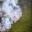
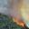
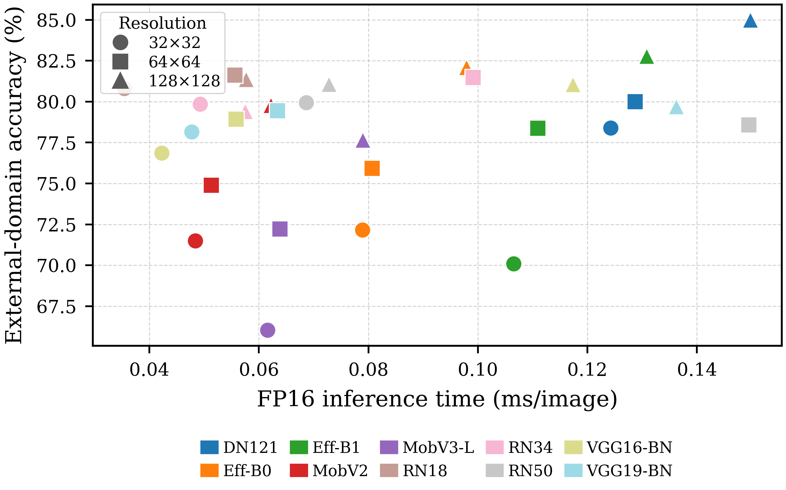
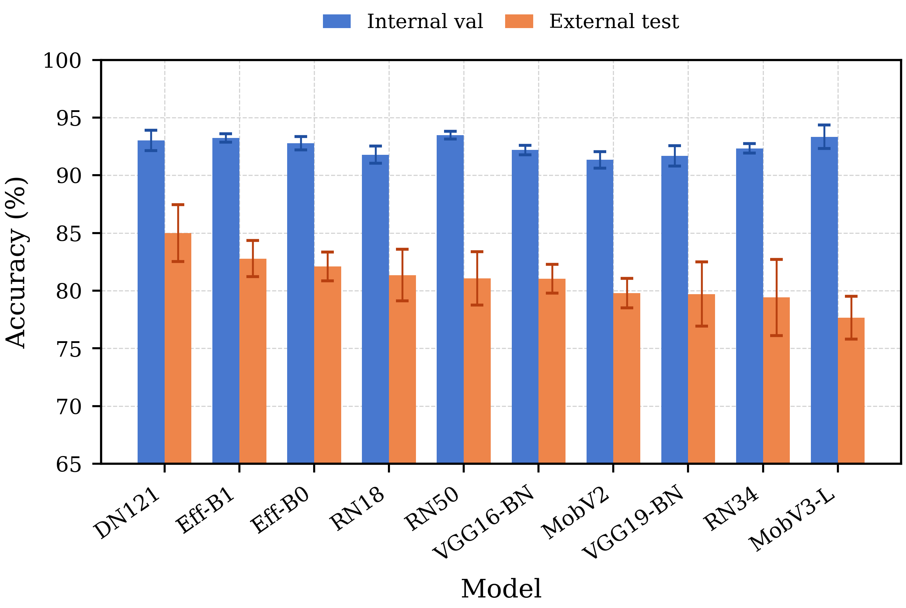
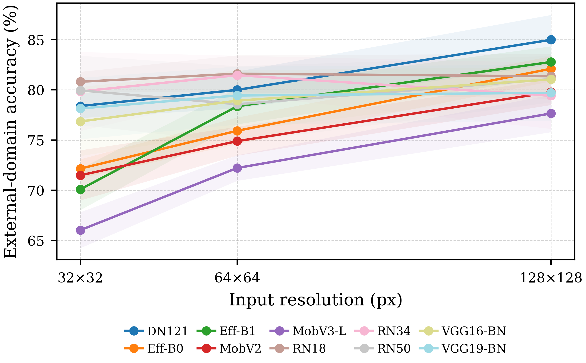
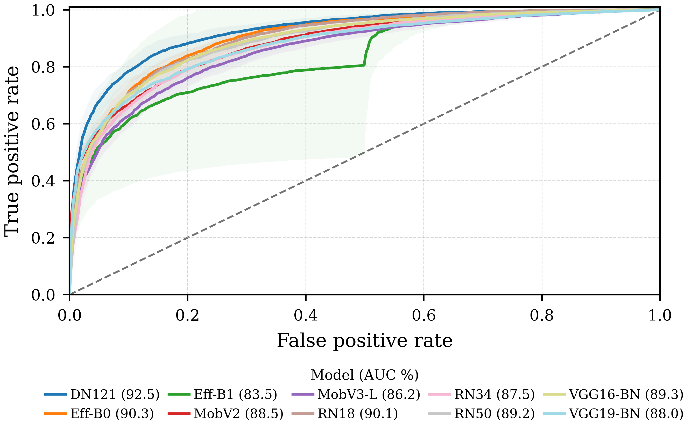
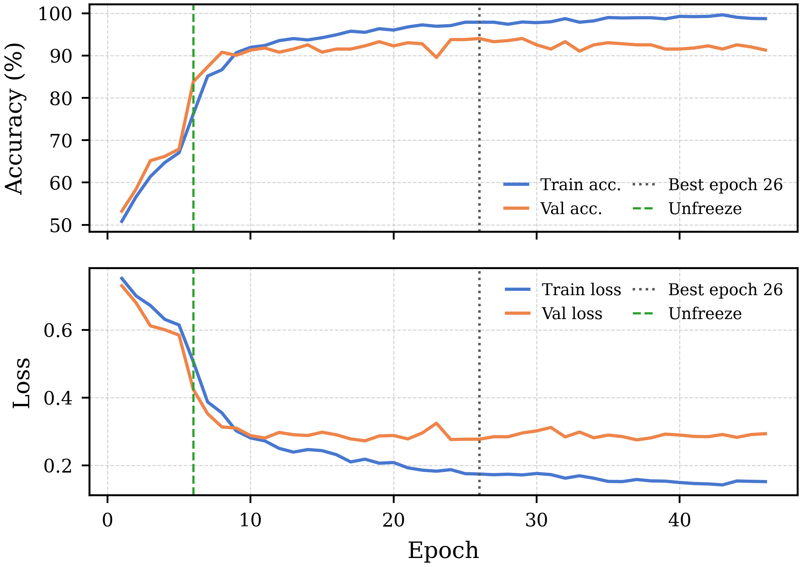
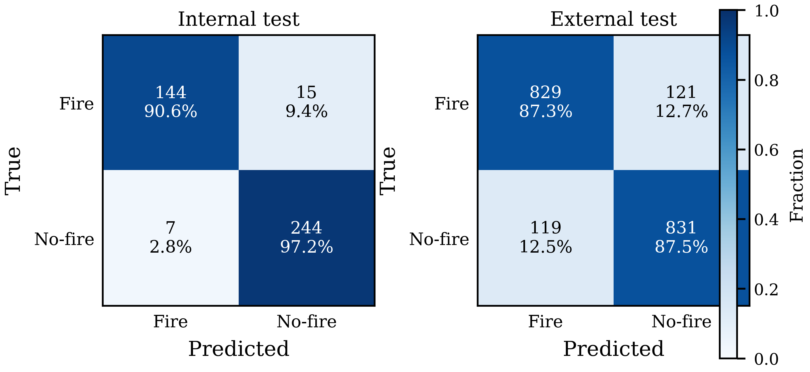

# Cross-Domain Generalization of Deep CNNs for Fire Detection

This repository contains the official implementation and experimental artifacts for **“Cross-Domain Generalization of Deep CNN Architectures for Fire Detection: A Multi-Resolution Benchmark with Mixed-Precision Inference.”**

The project evaluates ten ImageNet-pretrained convolutional neural networks (CNNs) for binary **fire / no-fire** image classification. Unlike a conventional single-dataset benchmark, models are trained on a wildfire source domain and evaluated on a distinct forest-fire domain that is never used during training or validation. The goal is to measure whether strong in-distribution accuracy survives realistic dataset shift, while also quantifying the accuracy–latency trade-off at three input resolutions.

> **Main finding:** DenseNet-121 at 128×128 provides the strongest external-domain performance (84.99 ± 2.48% accuracy; 92.51 ± 1.73% ROC-AUC). ResNet-18 at 32×32 is the fastest configuration (0.0354 ms/image with FP16 inference), reaching 80.81 ± 0.99% external accuracy.

## Contents

- [Research question](#research-question)
- [Experimental design](#experimental-design)
- [Repository layout](#repository-layout)
- [Dataset layout](#dataset-layout)
- [Installation](#installation)
- [Training with `main.py`](#training-with-mainpy)
- [Results](#results)
- [Reproducibility and outputs](#reproducibility-and-outputs)
- [Limitations](#limitations)
- [Citation](#citation)

## Research question

Image-classification models for fire detection are often evaluated on a random test split from the same dataset used for training. Such results can overstate field performance because a deployed model will encounter different cameras, backgrounds, lighting, smoke patterns, flame scales, and environments.

This benchmark answers three related questions:

1. Which CNNs maintain performance on an independently collected fire-image domain?
2. How does input resolution (32×32, 64×64, and 128×128 pixels) affect cross-domain accuracy?
3. Which configuration provides the most useful external-accuracy versus FP16-inference-latency trade-off for edge or UAV deployment?

This is an image-level screening benchmark, not an object-detection or segmentation system. It predicts whether an image contains fire.

## Experimental design

### Domains and splits

The source **Wildfire** domain supplies the training, validation, and internal-test splits. The independent **Forest Fire** domain is retained exclusively as `test_e` (external test). No image from `test_e` participates in model selection, training, or augmentation.

| Split | Domain | Purpose | Images / balance |
|---|---|---|---|
| `train` | Wildfire (source) | Model fitting | 730 fire, 1,157 no-fire |
| `val` | Wildfire (source) | Checkpoint selection and early stopping | 402 images |
| `test` | Wildfire (source) | Internal hold-out evaluation | 410 images |
| `test_e` | Forest Fire (external) | Unseen cross-domain evaluation | 950 fire, 950 no-fire |

The source training data have a 1.58 majority/minority ratio, so the default `auto` weighted sampler is enabled at the project's threshold of 1.5. The external test set is balanced, which makes errors on the fire and no-fire classes easier to interpret.

### Resolution and visible domain shift

Every source image is prepared at 32×32, 64×64, and 128×128 pixels using the same split membership. The samples below are the same examples used in the paper. Spatial detail falls sharply at lower resolution, while the two domains also differ visibly in background, smoke, illumination, and flame appearance.

| Resolution | Internal fire | Internal no-fire | External fire | External no-fire |
|---|---|---|---|---|
| 32×32 |  |  |  |  |
| 64×64 |  |  |  |  |
| 128×128 |  |  |  |  |

### Architectures and common protocol

All models use ImageNet initialization and a new two-class classifier head with dropout (0.30). The benchmark includes:

`resnet18`, `resnet34`, `resnet50`, `mobilenet_v2`, `mobilenet_v3_large`, `efficientnet_b0`, `efficientnet_b1`, `vgg16_bn`, `vgg19_bn`, and `densenet121`.

Every configuration uses the same training protocol:

- Five epochs with the backbone frozen (`lr=1e-4`), followed by full fine-tuning (`lr=5e-5`).
- Adam optimization, `weight_decay=5e-4`, label smoothing of 0.05, and strong training-only augmentation.
- `ReduceLROnPlateau` learning-rate schedule (factor 0.5, patience 5) and early stopping after 20 epochs without validation improvement, capped at 100 epochs.
- ImageNet normalization. Training augmentation includes resized crops, horizontal flips, rotation, colour jitter, affine and perspective transforms, blur, sharpness adjustment, and random erasing.
- Five independent seeded runs (seeds 42–46) per architecture and resolution: 10 models × 3 resolutions × 5 seeds = **150 training runs**. This is repeated experimentation, not five-fold cross-validation.
- Final metrics come from the checkpoint with the best validation accuracy, rather than the last epoch.

FP16 timings are forward-pass-only measurements at batch size 32 with CUDA synchronization before and after each batch. They were collected on an NVIDIA RTX 5090 (32 GB) with PyTorch 2.12.0 and CUDA 13.0; absolute latency will vary on other hardware.

## Repository layout

```text
.
├── main.py                    # Training, evaluation, repetition, and export pipeline
├── Dataset.rar                # Dataset archive; extract to create Dataset/
├── Runs.part01.rar ...        # Split archive of supplied experiment outputs
├── paper/
│   ├── main.tex               # Paper source
│   ├── sample_images/         # Examples used in the paper's domain/resolution figure
│   └── graphs/                # Paper result figures (PNG and PDF)
└── README.md
```

## Dataset layout

Extract `Dataset.rar` before training. `main.py` expects this directory structure for each resolution:

```text
Dataset/
├── 32x32/
│   ├── train/{fire,nofire}/
│   ├── val/{fire,nofire}/
│   ├── test/{fire,nofire}/
│   └── test_e/{fire,nofire}/
├── 64x64/
│   └── ... same four splits ...
└── 128x128/
    └── ... same four splits ...
```

The names are significant: `test_e` is the external domain. Do not merge it with `train`, `val`, or `test` if you want results comparable with the paper.

## Installation

Python 3.10+ and PyTorch with TorchVision are required. A CUDA-capable GPU is strongly recommended for the full benchmark; CPU execution is supported but substantially slower. Install a PyTorch build appropriate for the local CUDA environment, then install the remaining dependencies:

```bash
pip install torch torchvision
pip install matplotlib pillow tqdm
```

For CPU-only use, install the CPU PyTorch wheels instead and pass `--device cpu --use_fp16 0` to the training command. Pretrained ImageNet weights are enabled by default; TorchVision may download them on the first run. Use `--pretrained 0` when offline or when deliberately training from scratch.

## Training with `main.py`

`main.py` is the project entry point. It trains one selected architecture, evaluates it on all four splits, exports plots and prediction files, and can repeat the full procedure across multiple random seeds.

```bash
python main.py --help
```

### Recommended paper reproduction commands

Run one command for each model and resolution. The following examples match the paper defaults and use five seeded repeats.

```bash
# Highest external-domain accuracy in this benchmark
python main.py --model densenet121 --data_root "Dataset/128x128" --batch_size 16 --epochs 100 --early_stop_patience 20 --repeat 5

# Lowest reported FP16 latency
python main.py --model resnet18 --data_root "Dataset/32x32" --batch_size 32 --epochs 100 --early_stop_patience 20 --repeat 5

# Accuracy/latency compromise
python main.py --model efficientnet_b0 --data_root "Dataset/128x128" --batch_size 32 --epochs 100 --early_stop_patience 20 --repeat 5
```

### Model-specific commands

The following commands train each supported backbone at 128×128. Add `--repeat 5` to any command when producing paper-style mean ± standard-deviation results. These batch sizes are the project's recommended starting points; reduce them if the available GPU memory is smaller.

```bash
python main.py --model resnet18            --data_root "Dataset/128x128" --batch_size 32 --epochs 100 --early_stop_patience 20
python main.py --model resnet34            --data_root "Dataset/128x128" --batch_size 32 --epochs 100 --early_stop_patience 20
python main.py --model resnet50            --data_root "Dataset/128x128" --batch_size 16 --epochs 100 --early_stop_patience 20
python main.py --model mobilenet_v2        --data_root "Dataset/128x128" --batch_size 32 --epochs 100 --early_stop_patience 20
python main.py --model mobilenet_v3_large  --data_root "Dataset/128x128" --batch_size 32 --epochs 100 --early_stop_patience 20
python main.py --model efficientnet_b0     --data_root "Dataset/128x128" --batch_size 32 --epochs 100 --early_stop_patience 20
python main.py --model efficientnet_b1     --data_root "Dataset/128x128" --batch_size 24 --epochs 100 --early_stop_patience 20
python main.py --model vgg16_bn            --data_root "Dataset/128x128" --batch_size 8  --epochs 100 --early_stop_patience 20
python main.py --model vgg19_bn            --data_root "Dataset/128x128" --batch_size 8  --epochs 100 --early_stop_patience 20
python main.py --model densenet121         --data_root "Dataset/128x128" --batch_size 16 --epochs 100 --early_stop_patience 20
```

To reproduce the full 30 model–resolution configurations, run each model with the automatic resolution scan. When `--data_root` is omitted, the script scans `Dataset/` for `32x32`, `64x64`, and `128x128` and trains sequentially:

```bash
python main.py --model resnet18 --dataset_base Dataset --repeat 5
```

Repeat this command with each supported `--model` value. The total experiment consists of 150 runs.

### Single-resolution and quick runs

Use `--data_root` to train one resolution only. The script automatically infers the image dimensions from folder names such as `128x128`.

```bash
# One run at 64×64, selecting CUDA automatically
python main.py --model mobilenet_v2 --data_root "Dataset/64x64"

# Fast smoke test: fewer epochs, no pretrained-weight download
python main.py --model resnet18 --data_root "Dataset/32x32" --epochs 2 --repeat 1 --pretrained 0

# CPU-only execution
python main.py --model resnet18 --data_root "Dataset/32x32" --device cpu --use_fp16 0
```

### Main options

| Option | Default | Meaning |
|---|---:|---|
| `--model` | `resnet18` | CNN architecture to train. |
| `--data_root` | none | Direct path to one resolution folder containing the four splits. |
| `--dataset_base` | `Dataset` | Base folder scanned when `--data_root` is omitted. |
| `--img_size` | `auto` | Detects the dimension from the dataset-folder name; may be set explicitly. |
| `--repeat` | `1` | Number of independent repeated runs. The seed increments from `--seed` for each repeat. |
| `--epochs` / `--batch_size` | `100` / `32` | Maximum epochs and training batch size. |
| `--device` | `auto` | `auto`, `cuda`, or `cpu`. |
| `--use_fp16` | `1` | Enables CUDA AMP mixed precision; set `0` on CPU. |
| `--pretrained` | `1` | Uses TorchVision ImageNet weights. |
| `--augment` | `strong` | Training augmentation: `off`, `basic`, or `strong`. |
| `--freeze_epochs` | `5` | Classifier-head-only epochs before unfreezing the backbone. |
| `--lr` / `--finetune_lr` | `1e-4` / `5e-5` | Learning rates before and after unfreezing. |
| `--use_weighted_sampler` | `auto` | `auto`, `yes`, or `no`; automatically handles the source imbalance. |
| `--num_workers` | `0` | DataLoader workers. `0` is safest for Windows/CUDA. |
| `--runs_base` | `Runs` | Root directory for run artifacts. |

For VGG-16-BN and VGG-19-BN, use a smaller batch size (for example `--batch_size 8`). For EfficientNet-B1 use `--batch_size 24`; for ResNet-50 and DenseNet-121 use 16 if memory is constrained.

## Results

### Results at a glance

<p align="center">
  
  
</p>
<p align="center">
  
  
</p>

The figures make three conclusions clear:

- **Internal accuracy is not sufficient for model selection.** ResNet-50 has the best internal validation score at 128×128 (93.48 ± 0.32%), but DenseNet-121 provides the best external accuracy. MobileNet-V3-Large drops from 93.33 ± 1.02% validation accuracy to 77.65 ± 1.86% external accuracy: a 15.7-point domain gap.
- **The best resolution depends on the architecture.** Enlarging ResNet-18 inputs from 32×32 to 128×128 increases latency by about 63% with little external-accuracy change. In contrast, EfficientNet-B0 gains nearly 10 external-accuracy points over the same resolution change for a roughly 24% latency increase.
- **External ROC performance reinforces the conclusion.** DenseNet-121 at 128×128 attains the best external ROC-AUC (92.51 ± 1.73%) and AP (92.49 ± 1.57%). EfficientNet-B1 at 128×128 has large AP/AUC variance across seeds, so its mean accuracy alone is not a sufficient stability measure.

### Full cross-domain benchmark

Values are mean ± standard deviation across five runs. `Val. Acc.` is source-domain validation accuracy; all other quality metrics are measured on the unseen external (`test_e`) domain. `FP16 IT` is milliseconds per image, measured on an RTX 5090 at batch size 32. Bold values mark the best column result.

| Model | Resolution | Val. Acc. (%) | Ext. Acc. (%) | AP (%) | ROC-AUC (%) | FP16 IT (ms) |
|---|---:|---:|---:|---:|---:|---:|
| ResNet-18 | 32×32 | 88.16 ± 1.08 | 80.81 ± 0.99 | 88.28 ± 1.39 | 88.25 ± 0.95 | **0.0354** |
| ResNet-18 | 64×64 | 90.05 ± 0.63 | 81.61 ± 1.84 | 90.20 ± 1.63 | 89.96 ± 1.50 | 0.0556 |
| ResNet-18 | 128×128 | 91.79 ± 0.73 | 81.36 ± 2.23 | 90.07 ± 2.29 | 90.14 ± 1.92 | 0.0576 |
| ResNet-34 | 32×32 | 88.76 ± 0.69 | 79.84 ± 3.93 | 87.84 ± 4.05 | 87.97 ± 3.83 | 0.0493 |
| ResNet-34 | 64×64 | 90.75 ± 1.08 | 81.46 ± 1.94 | 90.08 ± 2.02 | 90.00 ± 1.85 | 0.0991 |
| ResNet-34 | 128×128 | 92.34 ± 0.41 | 79.41 ± 3.29 | 87.60 ± 2.39 | 87.46 ± 3.09 | 0.0575 |
| ResNet-50 | 32×32 | 87.51 ± 0.54 | 79.95 ± 3.45 | 87.33 ± 2.96 | 87.58 ± 3.55 | 0.0687 |
| ResNet-50 | 64×64 | 89.60 ± 0.48 | 78.57 ± 3.79 | 87.69 ± 3.52 | 86.82 ± 3.49 | 0.1495 |
| ResNet-50 | 128×128 | **93.48 ± 0.32** | 81.07 ± 2.31 | 88.84 ± 1.37 | 89.21 ± 1.79 | 0.0728 |
| MobileNet-V2 | 32×32 | 79.95 ± 1.82 | 71.49 ± 2.50 | 80.40 ± 3.33 | 78.71 ± 3.00 | 0.0484 |
| MobileNet-V2 | 64×64 | 87.36 ± 1.10 | 74.89 ± 1.44 | 84.23 ± 1.43 | 83.47 ± 1.81 | 0.0513 |
| MobileNet-V2 | 128×128 | 91.34 ± 0.71 | 79.78 ± 1.28 | 89.52 ± 0.94 | 88.47 ± 0.97 | 0.0622 |
| MobileNet-V3-Large | 32×32 | 75.17 ± 1.84 | 66.03 ± 1.79 | 70.43 ± 2.38 | 72.13 ± 2.19 | 0.0616 |
| MobileNet-V3-Large | 64×64 | 88.61 ± 0.64 | 72.22 ± 1.27 | 81.81 ± 1.08 | 80.37 ± 1.71 | 0.0639 |
| MobileNet-V3-Large | 128×128 | 93.33 ± 1.02 | 77.65 ± 1.86 | 87.34 ± 1.95 | 86.23 ± 2.18 | 0.0790 |
| EfficientNet-B0 | 32×32 | 79.25 ± 1.83 | 72.16 ± 0.93 | 78.88 ± 1.48 | 80.10 ± 1.14 | 0.0789 |
| EfficientNet-B0 | 64×64 | 87.26 ± 0.59 | 75.93 ± 1.32 | 84.78 ± 0.83 | 84.22 ± 1.10 | 0.0807 |
| EfficientNet-B0 | 128×128 | 92.79 ± 0.58 | 82.11 ± 1.25 | 90.49 ± 1.28 | 90.33 ± 1.12 | 0.0979 |
| EfficientNet-B1 | 32×32 | 78.31 ± 1.22 | 70.09 ± 2.06 | 75.76 ± 2.76 | 77.62 ± 2.29 | 0.1065 |
| EfficientNet-B1 | 64×64 | 88.66 ± 0.57 | 78.37 ± 1.79 | 88.10 ± 1.66 | 87.16 ± 1.65 | 0.1109 |
| EfficientNet-B1 | 128×128 | 93.23 ± 0.37 | 82.78 ± 1.56 | 84.23 ± 15.06 | 83.50 ± 16.27 | 0.1308 |
| DenseNet-121 | 32×32 | 87.11 ± 0.69 | 78.39 ± 1.19 | 87.45 ± 0.79 | 86.96 ± 0.92 | 0.1242 |
| DenseNet-121 | 64×64 | 90.25 ± 0.69 | 80.00 ± 1.84 | 88.91 ± 1.29 | 88.53 ± 1.52 | 0.1287 |
| DenseNet-121 | 128×128 | 93.03 ± 0.88 | **84.99 ± 2.48** | **92.49 ± 1.57** | **92.51 ± 1.73** | 0.1498 |
| VGG-16-BN | 32×32 | 87.91 ± 0.80 | 76.85 ± 3.44 | 84.73 ± 3.58 | 84.84 ± 3.35 | 0.0423 |
| VGG-16-BN | 64×64 | 90.40 ± 0.48 | 78.93 ± 3.03 | 87.01 ± 2.44 | 86.13 ± 2.85 | 0.0559 |
| VGG-16-BN | 128×128 | 92.19 ± 0.42 | 81.04 ± 1.24 | 89.22 ± 1.55 | 89.29 ± 1.18 | 0.1173 |
| VGG-19-BN | 32×32 | 87.61 ± 1.13 | 78.15 ± 3.06 | 85.43 ± 4.04 | 85.16 ± 3.41 | 0.0477 |
| VGG-19-BN | 64×64 | 90.40 ± 0.54 | 79.44 ± 2.89 | 88.20 ± 2.33 | 87.00 ± 2.94 | 0.0634 |
| VGG-19-BN | 128×128 | 91.69 ± 0.89 | 79.71 ± 2.79 | 89.10 ± 2.61 | 87.95 ± 2.39 | 0.1362 |

### Deployment-oriented model selection

| Deployment priority | Recommended configuration | Why |
|---|---|---|
| Maximum cross-domain reliability | DenseNet-121, 128×128 | Best external accuracy (84.99%), AP (92.49%), and ROC-AUC (92.51%). |
| Minimum GPU inference latency | ResNet-18, 32×32 | Fastest measured FP16 latency: 0.0354 ms/image, with 80.81% external accuracy. |
| Balanced accuracy and latency | EfficientNet-B0, 128×128 | 82.11% external accuracy and 90.33% ROC-AUC at 0.0979 ms/image. |

The precision/recall operating point can be adjusted after training. Use ROC-AUC and AP alongside accuracy when selecting a model, especially when the acceptable false-alarm rate depends on the deployment context.

### Additional paper figures

Training dynamics and the final split-wise confusion matrices for DenseNet-121 are included below. These are direct artifacts from the paper.

<p align="center">
  
  
</p>

## Reproducibility and outputs

With the default `--runs_root auto`, runs are written beneath `Runs/<Model>_<Resolution>_01/`. Repeated runs are separated into `Run_01`, `Run_02`, and so on.

```text
Runs/DenseNet121_128x128_01/
├── weights/
│   └── Run_01/
│       ├── best_val_model.pth
│       ├── best_val_model_state_dict_only.pth
│       └── last_model.pth
└── results/
    └── Run_01/
        ├── config.json
        ├── final_results.json
        ├── training_history.json
        ├── training_log.csv
        ├── dataset_balance_report.json
        ├── predictions_test_e.csv
        ├── detailed_metrics_test_e.json
        ├── roc_curve_test_e.csv
        ├── precision_recall_curve_test_e.csv
        └── plots/
```

The final reported metrics use `best_val_model_state_dict_only.pth`, the checkpoint selected by validation accuracy. The script also creates `repeat_summary.csv` and `repeat_summary.json` after repeated runs, and appends row-level results to `Runs/master_summary.csv` and `Runs/master_summary.jsonl` for cross-experiment aggregation.

The supplied `Runs.part01.rar` through `Runs.part05.rar` files form a multi-part archive of experiment outputs. Keep all parts together when extracting.

## Limitations

- The benchmark measures image-level fire/no-fire classification; it does not localize flames, smoke, or fire boundaries.
- The external evaluation uses one independently collected forest-fire domain. Further geographic, seasonal, camera, and weather domains are required before making broad operational claims.
- The latency numbers are GPU forward-pass measurements on an RTX 5090 with batch size 32. They exclude image loading, transfer, post-processing, and end-to-end camera or network overhead.
- A deployment must set and validate its decision threshold against local false-alarm and missed-detection requirements.

## Citation

If this repository supports your work, please cite the accompanying paper and link to this repository. The manuscript source is available at [paper/main.tex](paper/main.tex).

```bibtex
@article{talha2026crossdomainfirecnn,
  title   = {Cross-Domain Generalization of Deep CNN Architectures for Fire Detection: A Multi-Resolution Benchmark with Mixed-Precision Inference},
  author  = {Talha, Muhammad and Tauqeer, Syed Muhammad Hamza and Ghafoor, Huma},
  year    = {2026},
  note    = {Code available at: https://github.com/<your-org-or-user>/crossdomain-fire-cnn}
}
```

Replace `<your-org-or-user>` with the final GitHub owner before publishing.

## Authors

Muhammad Talha, Syed Muhammad Hamza Tauqeer, and Huma Ghafoor
School of Electrical Engineering and Computer Science / Military College of Signals, National University of Sciences and Technology (NUST), Pakistan
